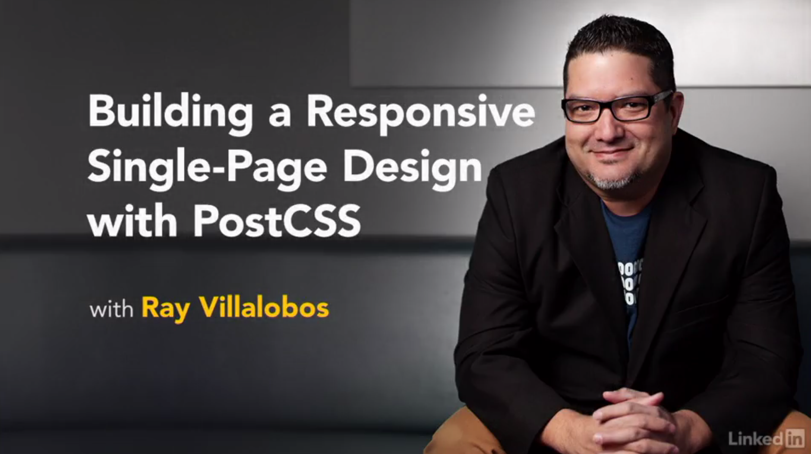

# Responsive Single Page Design with PostCSS

This is the repository for my course: Responsive Single Page Design with PostCSS. The full course is at [lynda.com](http://lynda.com) soon.

- [My Personal Website](http://raybo.org)
- [All of my Lynda.com courses](http://lynda.com/ray)

## Description
Learn how to create responsive single-page websites with PostCSS, the CSS post-processor engine that extends the power of CSS through JavaScript. These step-by-step instructions take existing HTML markup and add style, animation, and responsive navigation. This combination allows for dynamic one-page sites—a popular design that's now even faster and easier to create with PostCSS. Along the way, Ray Villalobos introduces some handy plugins, tips for integrating PostCSS into a Gulp-based workflow, and techniques for making layouts more responsive with Flexbox.

### Topics include

- Structuring the HTML markup for a single-page design
- Using PreCSS Sass-like imports in PostCSS
- Creating Sass-like variables with PreCSS
- Building styles
- Creating a layout for the header and navigation with Flexbox
- Creating and styling sections
- Animating page elements with PostCSS

## Instructions
This repository has branches for each of the videos in the course. You can use the branch pop up menu in github to switch to a specific branch and take a look at the course at that stage. Or you can simply add `/tree/BRANCH_NAME` to the URL to go to the branch you want to peek at.

1. Make sure you have these installed
	- [node.js](http://nodejs.org/)
	- [git](http://git-scm.com/)
 	- [gulp](http://gulpjs.com/)
2. Clone this repository into your local machine using the terminal (mac) or Gitbash (PC) `> git clone https://github.com/planetoftheweb/postcsslayouts.git`
3. CD to the folder `cd postcsslayouts`
4. Run `> npm install` to install the project dependencies

For more help setting up a comprehensive Gulp.js workflow, check out [Web Project Workflows with Gulp.js, Git, and Browserify](http://www.lynda.com/Web-Web-Design-tutorials/Web-Project-Workflows-Gulpjs-Git-Browserify/154416-2.html).

## More Stuff
Check out some of my [other courses on lynda.com](http://lynda.com/rayvillalobos). You can also check out my [youtube channel](http://youtube.com/planetoftheweb), [follow me on twitter](http://twitter.com/planetoftheweb), or read [my blog](http://iviewsource.com).
